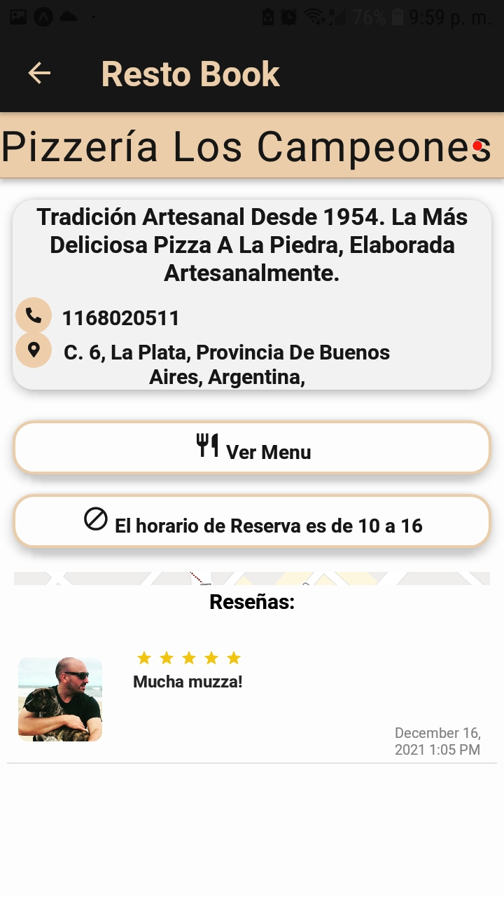

                                                                                    

#

#### Aplicacion mobile creada por un grupo de 7 desarolladores incluyendome, app desarollada en react native para el front y firebase para el back, dentro de sus funcionalidades mas importantes estan la geolocalisacion de locales gastronomicos por cercania o zona, la posibilidad de crear tu resto/bar y sus sucursales, hacer reservas, pagarlas. Las reservas tienen un cupo que pone el propio dueño del resto, asi tambien como el valor de la misma y el horario en que se puede hacer las reservas. Restobook cuenta con un perfil de usuario personalizable y es alli donde se puede visualizar las reservas realizadas y los locales favoritos, entre otras funcionalidades mas.

#

#### Tech Stack :

 
 
 
 

 

 

#

#### Algunas imagenes de la app: 

<kbd> 
                
           
           
       </kbd>
  

  

  <kbd> 
              
       
       
  </kbd>

#

#### Developers: 

##### Ramiro Fazio | [Linkedin](https://www.linkedin.com/in/ramiro-fazio-dattoli/) | [Github](https://github.com/ramirofazio)
##### Laial Sapaguin Serpa | [Linkedin](https://www.linkedin.com/in/laial-sapaguin-fullstack/) | [Github](https://github.com/Laial-S)
##### Lucas Roman Gervasi | [Linkedin](https://www.linkedin.com/in/lucas-roman-gervasi-419463200) | [Github](https://github.com/LucasRomanGervasi )
##### Franco Brizuela | [Linkedin](https://www.linkedin.com/in/francobrizuela-dev) | [Github](https://github.com/FrancoBrizuela96)
##### Lucas Mira | [Linkedin](https://www.linkedin.com/in/lucas-nahuel-mira) | [Github](https://github.com/LucasMira93)
##### Jose Luis Santangelo | [Linkedin](https://www.linkedin.com/in/jose-luis-santangelo-fullstack/) | [Github](https://github.com/josesantangelo)
##### Martin Galliano  | [Linkedin](https://www.linkedin.com/in/martin-galliano-hr/) | [Github](https://github.com/MartinGalliano)

#

#### TL Proyect (by Henry) :
##### Elena Gonzales | [Linkedin](https://www.linkedin.com/in/ele-gonzalez//) | [Github](https://github.com/elenaGonzalez)

