

                                                                                    

#
#### RESTO BOOK 

With a group of 7 developers, we developed a mobile app. The idea of the app is to solve the problem of time to decide where to go to dinner or go for a drink with friends.
 As a User you can search for the company you want, order them, filter them, see the meals, the menu and make a reservation in it through MercadoPago,
as a Company you can administer your company, modify the reservation schedule, the price, add or eliminate meals, and view your company's statistics.
To develop RestoBook we use the following technologies: JavaScript, NodeJS, NPM, Expo CLI, FireBase, React-Native, HTML y CSS.

Con un grupo de 7 desarrolladores, desarrollamos una app movil. La idea de la app es resolver el problema de tiempo para decidir donde ir a cenar o ir a tomar algo con amigos.
 Como Usuario podes buscar la empresa que vos quieras, ordenarlas, filtrarlas, ver las meals, la carta y hacer una reserva en el mismo a traves de mercadoPago,
como Empresa podes adminstrar tu empresa, modificar el horario de reserva, el precio, agregar o eliminar comidas, y ver estadisticas de tu empresa.
Para desarrollar RestoBook usamos las siguentes tecnologias: JavaScript, NodeJS, NPM, Expo CLI, FireBase, React-Native, HTML y CSS.

#

#### Tech Stack :

 
 
 

 

 

#

#### Some images of the app / Algunas imagenes de la app: 

<kbd> 
       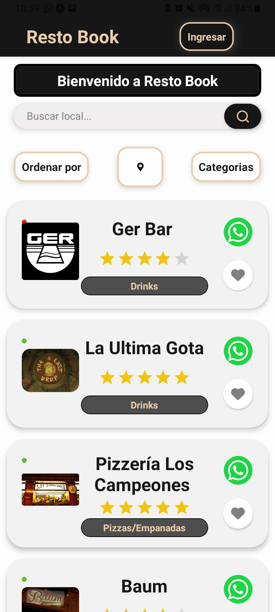         
           
       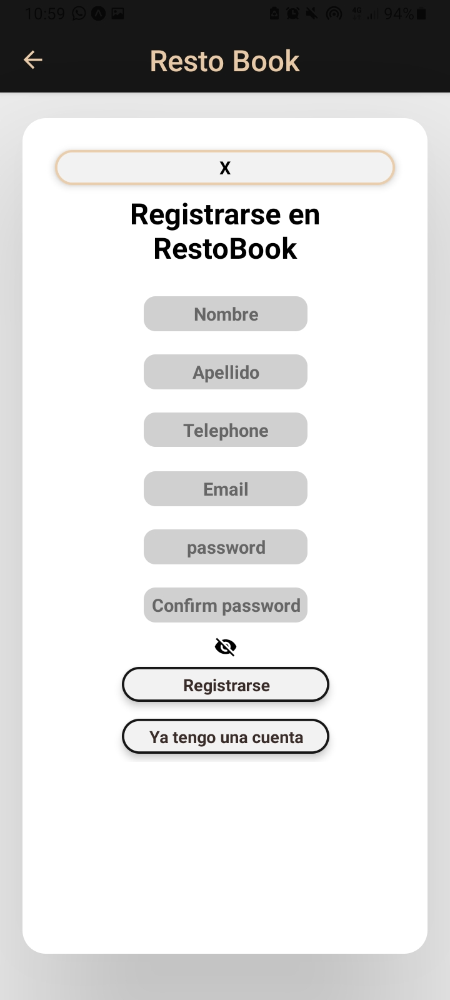    
       </kbd>
  

  

  <kbd> 
      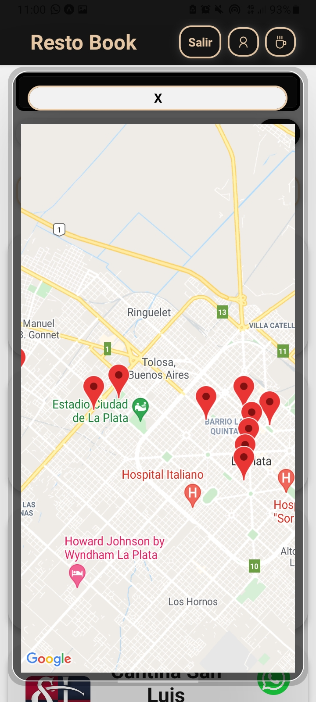        
      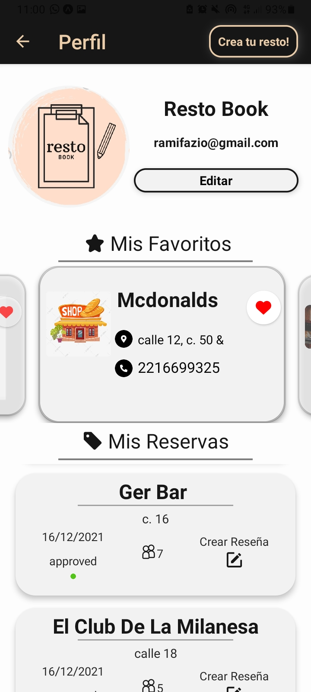 
      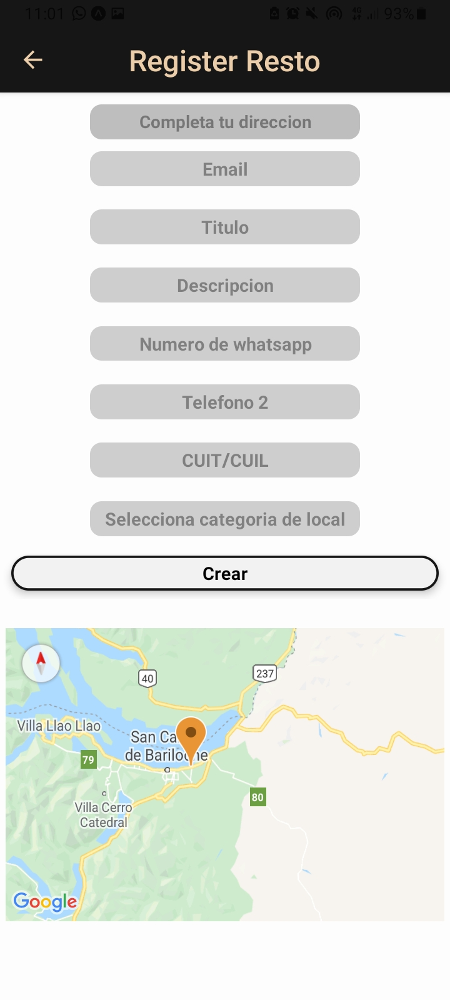 
  </kbd>

  <kbd> 
      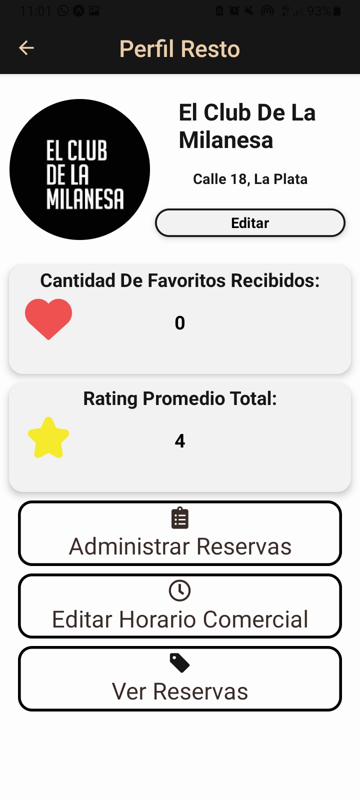        
      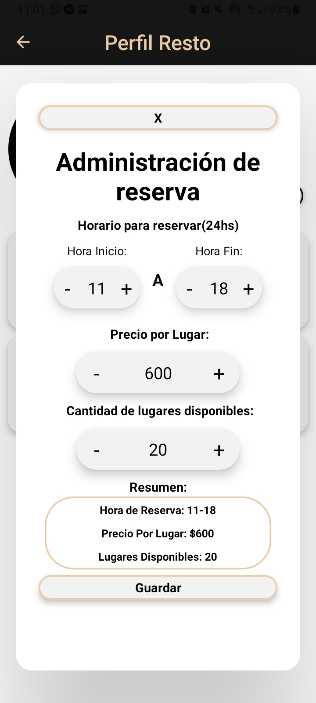 
      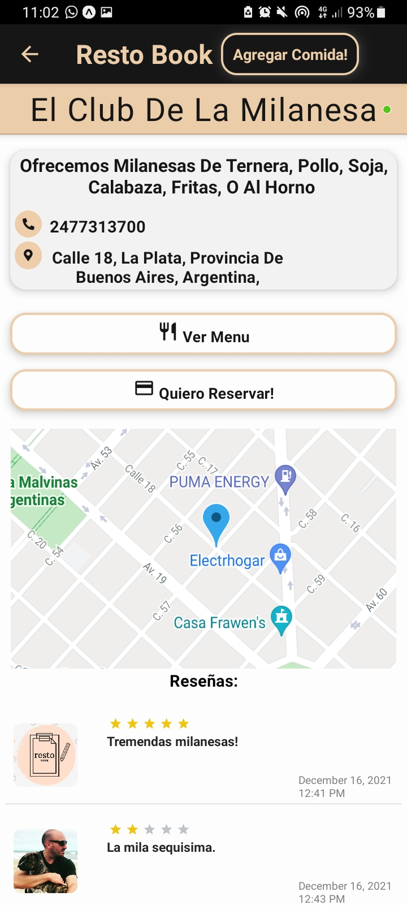 
  </kbd>

  <kbd> 
      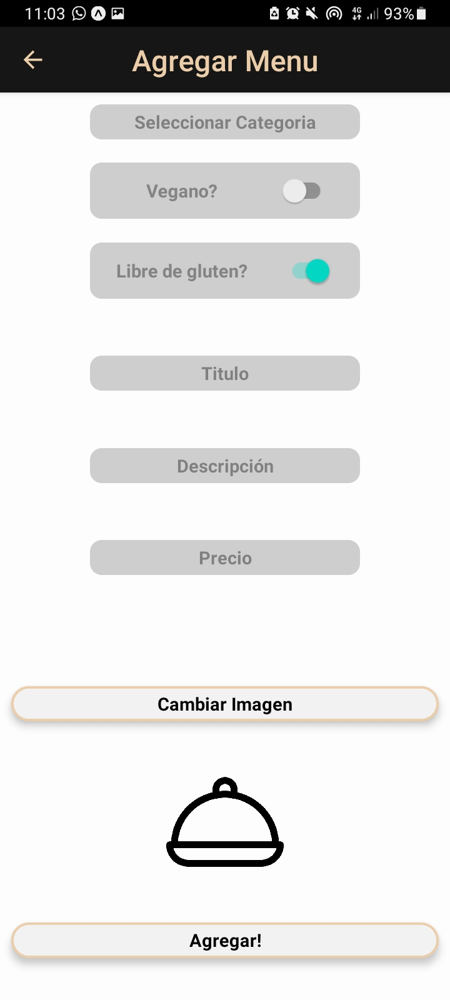        
      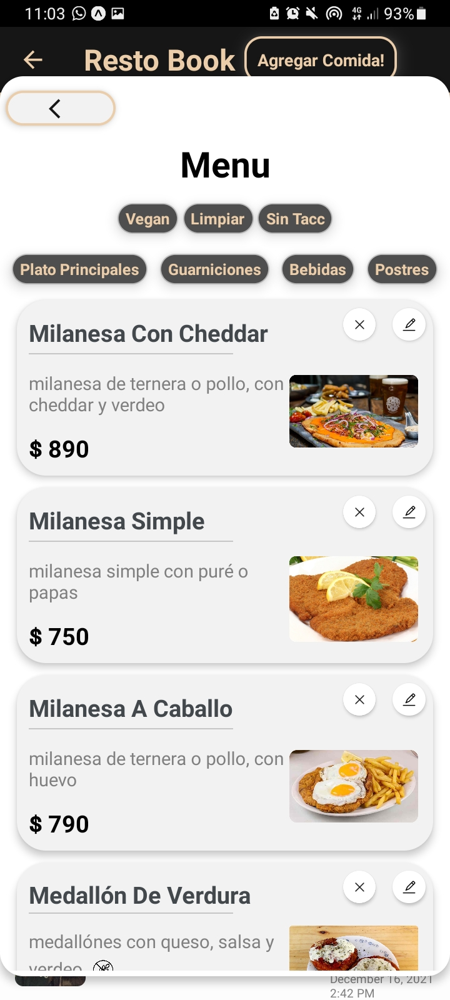 
      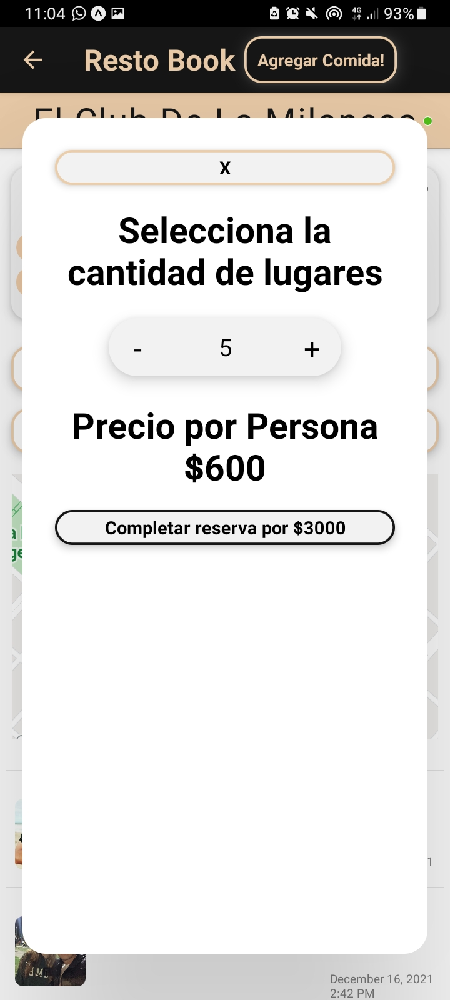 
  </kbd>

#

#### Developers / Desarrolladores: 

##### Ramiro Fazio | [Linkedin](https://www.linkedin.com/in/ramiro-fazio-dattoli/) | [Github](https://github.com/ramirofazio)
##### Laial Sapaguin Serpa | [Linkedin](https://www.linkedin.com/in/laial-sapaguin-fullstack/) | [Github](https://github.com/Laial-S)
##### Lucas Roman Gervasi | [Linkedin](https://www.linkedin.com/in/lucas-roman-gervasi-419463200) | [Github](https://github.com/LucasRomanGervasi )
##### Franco Brizuela | [Linkedin](https://www.linkedin.com/in/francobrizuela-dev) | [Github](https://github.com/FrancoBrizuela96)
##### Lucas Mira | [Linkedin](https://www.linkedin.com/in/lucas-nahuel-mira) | [Github](https://github.com/LucasMira93)
##### Jose Luis Santangelo | [Linkedin](https://www.linkedin.com/in/jose-luis-santangelo-fullstack/) | [Github](https://github.com/josesantangelo)
##### Martin Galliano  | [Linkedin](https://www.linkedin.com/in/martin-galliano-hr/) | [Github](https://github.com/MartinGalliano)

#

#### TL Proyect (by Henry) :
##### Elena Gonzales | [Linkedin](https://www.linkedin.com/in/ele-gonzalez//) | [Github](https://github.com/elenaGonzalez)

